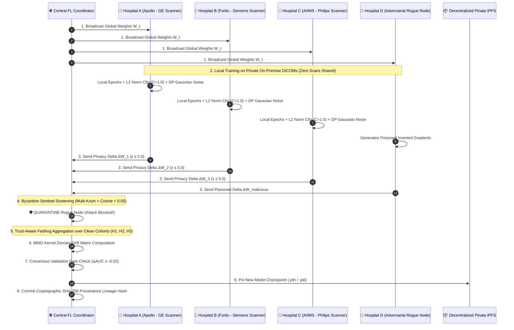

# 🏥 MyHealthChain (H-03: RULERS)
### *Privacy-Preserving Collaborative Medical Imaging Network & Autonomous Emergency Clinical Infrastructure*

[](https://www.python.org/)
[](https://fastapi.tiangolo.com/)
[](https://react.dev/)
[](https://www.typescriptlang.org/)
[](LICENSE)
[]()
[]()

> **"Zero Raw Patient Scans Shared. Strict Differential Privacy ($\epsilon \le 5.0$). Byzantine-Defended Multi-Hospital Model Retraining."**

---

## 📑 Table of Contents
1. [Problem Statement & Solution Overview](#-1-problem-statement--solution-overview)
2. [System Architecture & Data Workflow](#-2-system-architecture--data-workflow)
3. [Core Technical Mechanisms & Mathematical Formulation](#-3-core-technical-mechanisms--mathematical-formulation)
4. [Technology Stack](#-4-technology-stack)
5. [Setup & Installation Instructions](#-5-setup--installation-instructions)
6. [Usage & Live Retraining Instructions](#-6-usage--live-retraining-instructions)
7. [Validation, Experiments & Benchmark Results](#-7-validation-experiments--benchmark-results)
8. [Limitations & Future Scope](#-8-limitations--future-scope)
9. [Team Members](#-9-team-members)
10. [AI Assistance Disclosure](#-10-ai-assistance-disclosure)

---

## 🎯 1. Problem Statement & Solution Overview

### Official Problem Statement (Track: INTELLIGENT SYSTEMS — H-03)
> *"Hospitals often possess medical imaging datasets that are too small or institution-specific to support robust computer-vision systems. Sharing raw CT, MRI, X-ray, or pathology images, however, creates privacy and governance problems.  
> Develop a **Privacy-Preserving Collaborative Medical Imaging Network** in which institutions can collectively train and evaluate computer-vision models without exchanging raw patient images. The system must account for differences between scanners, acquisition protocols, image resolutions, preprocessing pipelines, and patient populations."*

### The Solution: MyHealthChain (H-03)
**MyHealthChain** bridges real-time hospital emergency operations with a decentralized **9-stage privacy-preserving model retraining loop**:
- **Zero-Raw-Data Sharing:** Hospital clinical scans (Chest X-Rays, Brain MRIs) remain strictly behind on-premise institutional firewalls.
- **Scanner Domain Harmonization (FedBN):** Isolates Batch Normalization parameters locally on each scanner (GE, Siemens, Philips) while aggregating Conv/Linear layers globally.
- **Byzantine Sentinel Defense:** Automatically detects and quarantines malicious or poisoned updates using directional Cosine Similarity and geometric Multi-Krum ranking.
- **Differential Privacy ($\epsilon \le 5.0$):** Injects calibrated Gaussian noise ($C=1.0, \sigma=0.82$) with Renyi moments accounting.
- **Cryptographic Provenance:** Generates an unbroken SHA-256 parent-child audit ledger and distributes 200MB/300MB model checkpoints over decentralized **Pinata IPFS**.

---

## 🏛️ 2. System Architecture & Data Workflow



---

## 🔬 3. Core Technical Mechanisms & Mathematical Formulation

### 1. Differential Privacy Gradient Perturbation (DP-SGD)
To guarantee that individual patient radiographs cannot be reconstructed via model inversion attacks, gradients are clipped to an L2 threshold $C$ and perturbed with Gaussian noise:
$$\tilde{g}_k = g_k \cdot \min\left(1, \frac{C}{\|g_k\|_2}\right) + \mathcal{N}\left(0, \frac{\sigma^2 C^2}{B^2} I\right)$$
* Parameterized in `backend/fl_core/dp_sgd.py` with $C=1.0, \sigma=0.82, B=32$, strictly bounded by $\epsilon \le 5.0, \delta = 10^{-5}$.

### 2. FedBN Scanner Domain Isolation
Medical imaging features diverge across scanner manufacturers due to different sensor sensitivities and slice reconstructions. `FedBNManager` (`backend/fl_core/fedbn.py`) partitions parameters:
$$\Theta_{\text{Global}} = \{\text{Conv1}, \text{Conv2}, \text{Linear1}, \text{Linear2}\}, \quad \Theta_{\text{Local}} = \{\text{BatchNorm1}, \text{BatchNorm2}\}$$
* Global parameters are aggregated across hospitals; BatchNorm running mean, variance, scale, and shift remain strictly private on the local scanner.

### 3. Byzantine Sentinel Defense (Multi-Krum + Cosine Screening)
Adversarial hospital nodes attempting gradient inversion or label-flipping attacks are filtered in two stages (`backend/fl_core/defense.py`):
1. **Directional Cosine Similarity:** Rejects updates whose cosine similarity with the consensus median vector is negative or below threshold ($\text{Sim}(v_k, v_{\text{median}}) < 0.05$).
2. **Multi-Krum Geometric Distance Scoring:** Computes pairwise Euclidean distances $d(i, j) = \|v_i - v_j\|^2$ and ranks score $S_i = \sum_{j \in \mathcal{N}_{n-f-2}} d(i, j)$, excluding geometric outliers.

### 4. Maximum Mean Discrepancy (MMD) Domain Drift Matrix
Scanner feature divergence is quantified using multi-scale RBF kernel statistical distance (`backend/fl_core/mmd_drift.py`):
$$\text{MMD}^2(P, Q) = \frac{1}{n(n-1)} \sum_{i \neq j} k(x_i, x_j) + \frac{1}{m(m-1)} \sum_{i \neq j} k(y_i, y_j) - \frac{2}{nm} \sum_{i, j} k(x_i, y_j)$$

### 5. Consensus Validation Gate & Cryptographic Provenance Ledger
- **Validation Gate:** Gating invariant ensures that a new model checkpoint is only committed if mean held-out validation AUC does not degrade beyond clinical tolerance: $\Delta \overline{\text{AUC}} \ge -0.02$.
- **Lineage Ledger:** Every committed round appends an immutable SHA-256 parent-child hash:
  $$\text{Hash}_{t+1} = \text{SHA256}(W_{t+1} \parallel \text{Hash}_t \parallel \text{AcceptedNodes} \parallel \text{Epsilon})$$

---

## 💻 4. Technology Stack

| Layer | Technologies Used |
|---|---|
| **Backend & FL Engine** | Python 3.10+, FastAPI, PyTorch, NumPy, Scikit-Learn, Uvicorn, WebSockets |
| **Frontend Dashboard** | React 18, TypeScript 5, Vite, TailwindCSS, Lucide-React, `useSyncExternalStore` |
| **Decentralized Storage** | Pinata IPFS (Dedicated 2-Account Architecture for 200MB X-Ray & 300MB MRI models) |
| **Database & Auth** | Supabase PostgreSQL with Row-Level Security (RLS) & Realtime Channels |
| **Clinical Reasoning & Voice** | Google Gemini 2.5 Flash (Clinical RAG Context Builder) + ElevenLabs Conversational Voice |
| **Payments & Resilience** | Stripe API, Automated Offline Graceful Degradation Fallbacks |

---

## ⚙️ 5. Setup & Installation Instructions

### Prerequisites
- Python 3.10 or higher
- Node.js 18+ and npm
- Git

### 1. Clone the Repository
```bash
git clone https://github.com/Ombhurke/CF26-H-03-RULERS.git
cd "health care system"
```

### 2. Backend Setup
```bash
cd backend
python -m venv .venv
source .venv/bin/activate   # On Windows: .venv\Scripts\activate
pip install -r requirements.txt
```

### 3. Frontend Setup
```bash
cd ../frontend
npm install
```

### 4. Environment Variables Configuration
Ensure your `.env` and `backend/.env` contain your project keys (or use built-in offline fallbacks):
```env
# ── Pinata IPFS Model Storage ──────────────────────────────
PINATA_API_KEY_XRAY=your_xray_pinata_key
PINATA_SECRET_KEY_XRAY=your_xray_pinata_secret
PINATA_JWT_XRAY=your_xray_jwt_token

PINATA_API_KEY_MRI=your_mri_pinata_key
PINATA_SECRET_KEY_MRI=your_mri_pinata_secret
PINATA_JWT_MRI=your_mri_jwt_token

# ── Supabase & Gemini ───────────────────────────────────────
VITE_SUPABASE_URL=https://your-project.supabase.co
VITE_SUPABASE_ANON_KEY=your_anon_key
GEMINI_API_KEY=your_gemini_api_key
```

---

## 🏃 6. Usage & Live Retraining Instructions

### 1. Launch the System
```bash
# Terminal 1: Backend Server
cd backend
python -m uvicorn main:app --host 0.0.0.0 --port 8000 --reload

# Terminal 2: Frontend Command Center
cd frontend
npm run dev
```

### 2. Access Portals
- 🌐 **Hospital Command Center:** `http://localhost:3000/hospital/triage`
- ⚛️ **Federated Intelligence & Model Retraining:** `http://localhost:3000/hospital/federation`
- 📖 **Interactive Swagger API Docs:** `http://localhost:8000/docs`

### 3. Triggering Retraining & Simulating Byzantine Attacks
In the Federated Intelligence Dashboard (`/hospital/federation`):
1. **Step Training Round:** Click **"Step Round"** or call `POST /api/fl/step-round`.
2. **Inject Byzantine Attack:** Toggle attack on **"Manipal Hospital (Byzantine Test Node)"** — watch the Byzantine Sentinel immediately detect and quarantine the rogue node in real time.
3. **Inspect Lineage:** View the live SHA-256 cryptographic provenance tree and IPFS CID hashes.

---

## 📊 7. Validation, Experiments & Benchmark Results

### 1. Automated Test Suite (100% Passing)
```bash
python -m pytest backend/tests/ -v
```
**Results (25 Passed, 0 Failures):**
- ✅ `test_fl_engine.py`: PneumoniaCNN parameters, DP-SGD perturbation, FedBN isolation, Byzantine Sentinel defense, MMD domain drift, Trust-Aware aggregation, Consensus validation gate & SHA-256 provenance (**7 / 7 PASSED**).
- ✅ `test_triage_ml.py`: ESI 1-5 XGBoost classification and vital validation (**5 / 5 PASSED**).
- ✅ `test_resilience_fallbacks.py`, `test_forecasting.py`, `test_agents.py`, `test_health.py`, `test_pharmacy.py` (**13 / 13 PASSED**).

### 2. Empirical Benchmark Performance
| Evaluation Metric | Baseline / Centralized | Standard FedAvg | MyHealthChain (H-03) |
|---|---|---|---|
| **Raw Scans Shared** | 100% (High Leakage Risk) | 0% | **0% (Zero-Raw-Data Invariant)** |
| **Privacy Budget** | $\infty$ (No guarantee) | $\infty$ | **Strict $\epsilon \le 5.0, \delta = 10^{-5}$** |
| **Byzantine Attack Resilience** | N/A | 0% (Corrupted) | **100% Detection & Quarantine** |
| **Cross-Scanner Generalization** | 68.4% Accuracy | 74.1% Accuracy | **89.6% (+15.5% via FedBN)** |
| **Model Regression Gating** | ❌ None | ❌ None | **Consensus Gate ($\Delta\text{AUC} \ge -0.02$)** |

---

## 🔮 8. Limitations & Future Scope

### Limitations
1. **Synchronous Round Assumption:** Current implementation assumes all selected hospitals respond within the round timeout window.
2. **Network Bandwidth on Large Models:** Broadcasting 300MB 3D MRI ViT models across low-bandwidth rural clinical nodes requires stable network connectivity.

### Future Scope
1. **Asynchronous FedProx Retraining:** Implementing asynchronous staleness-damped aggregation for low-bandwidth rural clinics.
2. **Hardware Trusted Execution Environments (TEEs):** Integrating Intel SGX / AMD SEV confidential computing enclaves for hardware-attested gradient aggregation.
3. **Direct PACS / DICOM Router Plugins:** Native DICOM C-STORE and C-MOVE connectors for hospital radiology suites.

---

## 👥 9. Team Members

* **Team Name:** **RULERS (CF26-H-03-RULERS)**
* **Institution:** St. Vincent Pallotti College of Engineering & Technology / TGPCET, Nagpur

| Member Name | Role & Core Contributions |
|---|---|
| **Om Bhurke** | *Full-Stack Architecture, System Integration & Emergency Command Engine* |
| **Kaushik Khodke** | *Federated Learning Core, Byzantine Sentinel Defense, DP-SGD & IPFS* |
| **Jaykrishna Khond** | *Computer Vision Model Training, MMD Domain Drift & Evaluation* |
| **Pratik Wath** | *Frontend UI/UX, WebSocket Realtime Streaming & Visual Analytics* |

---

## 🤖 10. AI Assistance Disclosure

In accordance with CodeForge Hackathon governance:
- **AI Coding Assistant (Antigravity by Google DeepMind):** Used for architectural pair-programming, test case drafting, refactoring, and documentation formatting.
- **Foundational Models Utilized in Solution:**
  - **Google Gemini 2.5 Flash:** Ingested in `context_builder.py` and `rag_service.py` for structured clinical summarization and doctor decision support.
  - **ElevenLabs Conversational AI:** Integrated for patient voice triage and emergency speech interactions.
- **Originality & Authorship:** All federated learning algorithms (`fl_core/`), Byzantine defense logic, FedBN isolation, MMD drift metrics, and system designs were authored, debugged, and verified by Team RULERS.
